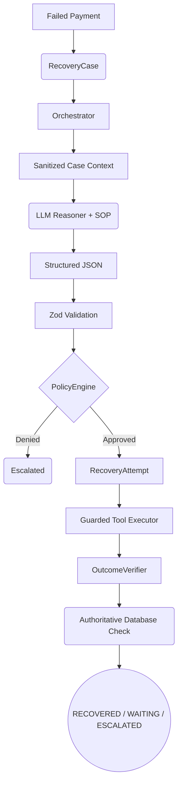

# AI Revenue Recovery Agent

An AI-assisted payment recovery workflow that diagnoses failed payments, recommends recovery actions, applies deterministic policy controls, executes guarded recovery tools, verifies outcomes, and durably records the recovery lifecycle.

This system replaces rigid, blind retry schedules with an intelligent, context-aware orchestrator. Crucially, the AI reasoning layer is completely untrusted and constrained by a deterministic application-owned Standard Operating Procedure (SOP) and a rigid Policy Engine to ensure strict financial safety.


---

## Project Snapshot

| Component | Technology |
|---|---|
| Backend | Node.js, Express, TypeScript, `tsx` |
| Frontend | Next.js 15, React 19, Tailwind CSS |
| Database | SQLite (Development) |
| ORM | Prisma |
| AI Integration | OpenAI SDK (configured for OpenRouter) |
| Output Validation | Zod |
| Testing | Vitest |

---

## The Problem

Failed payments occur for many reasons: insufficient funds, bank declines, invalid payment methods, expired cards, gateway errors, or network timeouts. Blindly retrying every failed payment is unsafe—it risks high failure rates, gateway penalties, and bad customer experiences. Different failures require different recovery actions (e.g., retrying a network timeout vs. emailing a customer about an expired card).

## The Solution

This system cleanly separates reasoning from execution. 

- **LLM**: The reasoning/recommendation layer.
- **Application Policy**: The deterministic safety enforcement layer.
- **Tools**: The controlled side-effect layer.
- **Verifier**: The authoritative outcome layer.
- **Database**: The durable state and audit layer.

**The LLM has absolutely no direct authority over financial state or database mutation.** It is merely an advisor to a strict, fail-closed state machine.

---

## Architecture Flow

The system orchestrates the lifecycle using the following components:



1. A failed payment is represented in the database.
2. A `RecoveryCase` enters the recovery workflow.
3. The **Orchestrator** loads sanitized case context (stripping PII).
4. The application-owned **SOP** is loaded.
5. The **LLM** receives the permitted context.
6. The **LLM** returns a structured JSON recommendation.
7. **Zod** validates the response schema.
8. The **PolicyEngine** strictly checks whether the recommended action is allowed under the SOP and business limits.
9. A `RecoveryAttempt` durably reserves the action.
10. The Guarded Tool executes.
11. The **OutcomeVerifier** checks the authoritative payment state from the database.
12. The `RecoveryCase` transitions to the appropriate state.
13. Successful customer outreach transitions the case to `WAITING_FOR_CUSTOMER`.
14. A valid external success event (e.g., a webhook) can atomically resume verification.

---

## AI & LLM Design

The AI layer is abstracted via a `ReasonerProvider`. The current implementation uses the OpenAI SDK configured to point to OpenRouter.

- The model returns strict JSON enforced by **Zod**.
- The model is supplied with a sanitized `SanitizedCaseContext`.
- If the provider times out or fails structure validation, the orchestrator handles the failure deterministically without crashing.

---

## SOP + Policy Engine

This system fundamentally separates the **SOP** (guidance) from the **PolicyEngine** (enforcement).

The current SOP maps scenarios logically:
- `INSUFFICIENT_FUNDS` → `NOTIFY_CUSTOMER`
- `BANK_DECLINED` → `NOTIFY_CUSTOMER`
- `INVALID_PAYMENT_METHOD` → `SEND_PAYMENT_LINK`
- `CARD_EXPIRED` → `SEND_PAYMENT_LINK`
- `GATEWAY_ERROR` → `RETRY_PAYMENT`
- `NETWORK_TIMEOUT` → `RETRY_PAYMENT`
- `REPEATED_FAILURE` → `ESCALATE_TO_HUMAN`

The LLM does not independently "invent" these rules; it uses its semantic reasoning to map complex failure contexts to this application-owned SOP. The **PolicyEngine** then deterministically verifies the output.

---

## Safety Model

| Layer | Responsibility |
|---|---|
| **LLM** | Diagnose failure and recommend action. |
| **Zod** | Validate structural integrity of the output. |
| **PolicyEngine** | Enforce safety rules, amount limits, and SOP constraints. |
| **RecoveryAttempt** | Durably reserve execution to prevent race conditions. |
| **Tool Executor** | Perform the controlled side-effect (e.g., gateway API call). |
| **OutcomeVerifier** | Verify the true authoritative state directly from the database. |
| **Database** | Persist state, enforce relations, and maintain the audit log. |

**Key Guardrails:**
- Invalid structured output is rejected instantly.
- Disallowed actions are deterministically blocked by the Policy Engine.
- Terminal states are mathematically protected from LLM interference.
- Financial mutations are guarded by execution tools.
- The outcome is verified from database state, rather than trusting a hallucinated LLM success message.

---

## Recovery Actions

The system currently supports:
- `RETRY_PAYMENT`: Synchronous gateway retry.
- `SEND_PAYMENT_LINK`: Outreach action.
- `NOTIFY_CUSTOMER`: Outreach action.
- `ESCALATE_TO_HUMAN`: Terminal fallback.

**Note:** `SEND_PAYMENT_LINK` and `NOTIFY_CUSTOMER` do not result in immediate recovery. They transition the case to `WAITING_FOR_CUSTOMER` pending asynchronous completion.

---

## State Machine

The case lifecycle moves through deterministic states:

`DETECTED` → `DIAGNOSING` → `DIAGNOSED` → `STRATEGY_PENDING` → `POLICY_CHECK` → `ACTION_APPROVED` → `EXECUTING` → `VERIFYING`

Terminal / Paused States:
- `RECOVERED`
- `ESCALATED`
- `CLOSED`
- `WAITING_FOR_CUSTOMER`

---

## Idempotency & Asynchronous Recovery

**Application Idempotency:**
The system uses Compare-and-Swap (CAS) `updateMany` queries to ensure exactly-once state transitions within the application boundary. A `RecoveryAttempt` durably reserves execution.

**Asynchronous Recovery:**
Cases requiring customer interaction enter `WAITING_FOR_CUSTOMER`. When an external success event occurs, the system atomically claims the waiting case and transitions it to `VERIFYING`, executing the `OutcomeVerifier`.
*(Note: The repository currently models and tests the resume path, but does not provide a production webhook integration endpoint).*

---

## Evaluation & Results

The system is evaluated using a controlled baseline and an unseen generated dataset to measure Action/Policy Conformance.

- **Ground truth** is isolated from the runtime agent and evaluator path, but is source-controlled for benchmark reproducibility.
- Evaluation tracks provider failures, policy denials, and execution success.

| Evaluation | Cases | Action/Policy Conformance | Simulated Recovery Rate |
|---|---:|---:|---:|
| Controlled Benchmark | 58 | 100% | N/A |
| Unseen Compositions | 100 | 100% | 42% |

*(Note: "Simulated Recovery Rate" is generated by a deterministic synthetic simulator testing the end-to-end flow; it is not live financial data).*

---

## Directory Structure

```text
apps/
  api/
    prisma/         # Database schemas and migrations
    src/
      agent/        # Orchestrator, LLM Reasoner, Policy Engine, Tools
      evaluation/   # Benchmark suites and simulators
      seed/         # Evaluation ground truth and database seed scripts
  web/              # Next.js frontend scaffolding
```

---

## Installation & Setup

1. **Clone the repository:**
   ```bash
   git clone https://github.com/gireesh2658/finance_recovery_system.git
   cd finance_recovery_system
   ```

2. **Install dependencies:**
   ```bash
   npm install
   ```

3. **Configure Environment:**
   Copy the example environment file in `apps/api`:
   ```bash
   cp apps/api/.env.example apps/api/.env
   ```
   Edit `apps/api/.env` and add your provider key:
   ```env
   AI_PROVIDER=OPENROUTER
   OPENROUTER_API_KEY=your_key_here
   OPENROUTER_MODEL=anthropic/claude-3-haiku
   DATABASE_URL="file:./dev.db"
   ```

4. **Initialize Database:**
   ```bash
   npm run prisma:generate --workspace=apps/api
   npm run db:push --workspace=apps/api
   ```

5. **Start the API Server:**
   ```bash
   npm run dev --workspace=apps/api
   ```

---


## Limitations

- **Database:** SQLite is used for development/testing. Production-grade PostgreSQL deployment is not implemented.
- **Webhooks:** No production webhook integration endpoint exists (only internal atomic resume logic is modeled).
- **Idempotency:** External payment-gateway idempotency (e.g., `Idempotency-Key` headers) is mocked but not integrated with a real gateway.
- **Linting:** Backend linting is not fully configured at the root level.
- **Test Infrastructure:** SQLite parallel test teardowns cause intermittent lock failures.

---

## Future Work

- PostgreSQL production migration.
- Implementation of a real webhook ingestion endpoint.
- External gateway sandbox integration to prove end-to-end idempotency.
- Background sweeper for crash recovery of `EXECUTING` states.

---

## Security Model

The system enforces a strict boundary between reasoning and execution.
- API keys are managed securely via environment variables.
- The LLM has no direct database mutation authority.
- All structured outputs are validated before processing.
- The system does not store live credit card numbers or PCI data.
- Every state transition and agent decision is durably logged in `AgentDecision` and `AuditEvent` tables for full auditability.

*(Note: This is an academic/prototype system. It is not PCI compliant or certified for production payment processing).*

---

